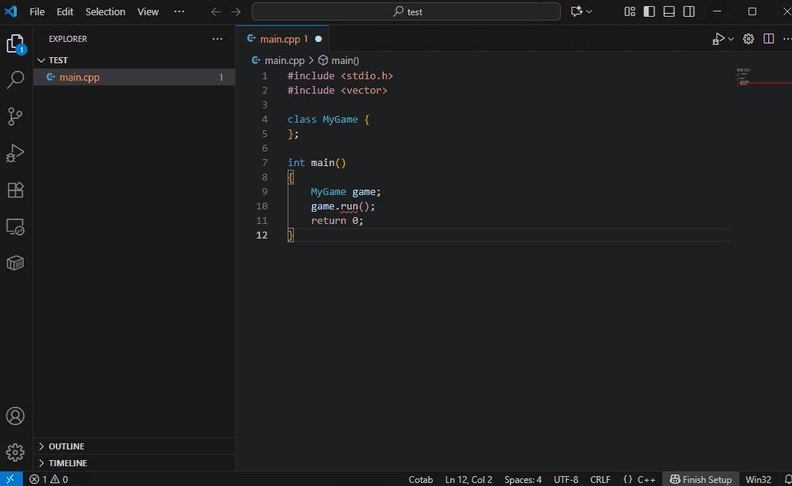
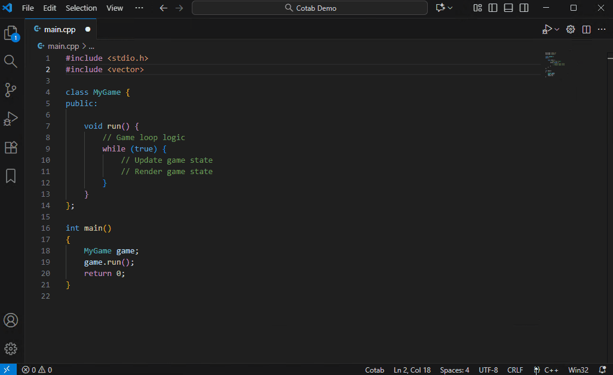
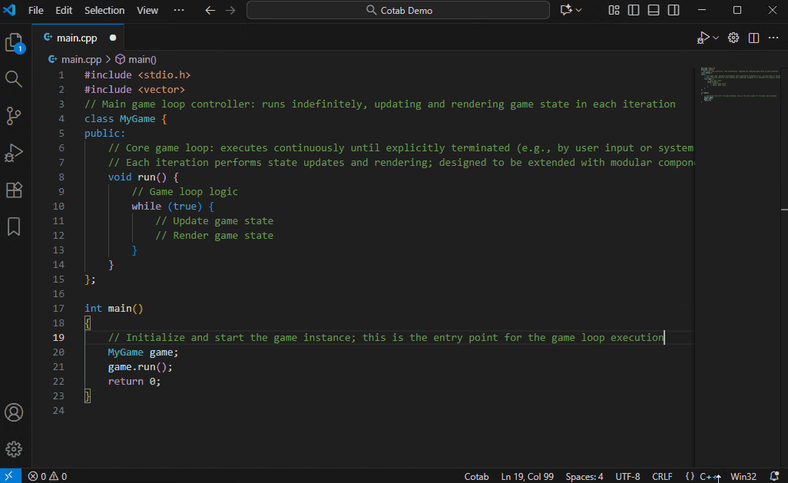
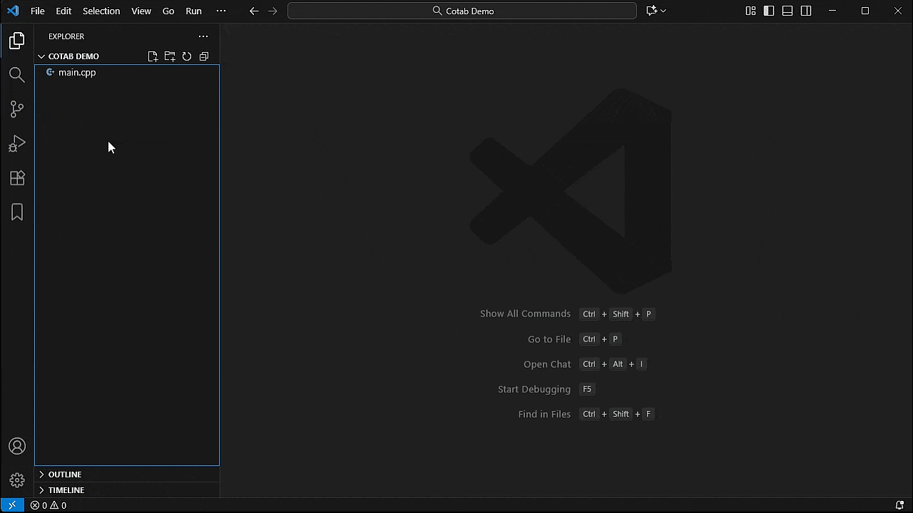
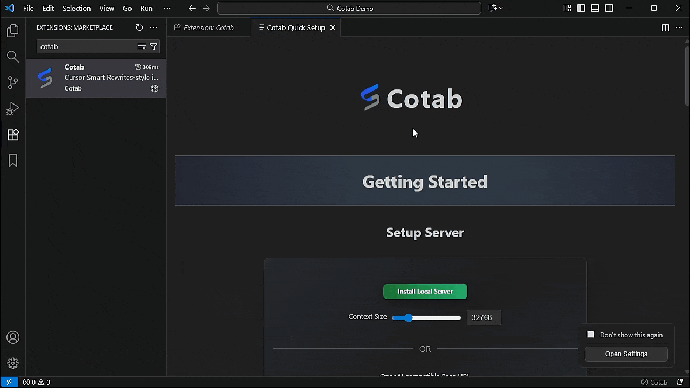
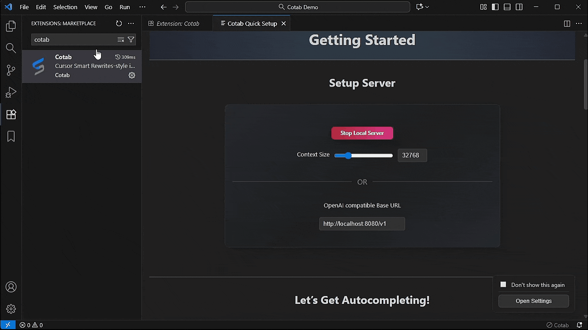

# Cotab
This VS Code extension is an AI-powered multi-line autocomplete plugin designed with maximum privacy and security in mind by running entirely on a local LLM.

It generates multiple lines of code using AI based not only on the entire file’s context but also on external symbols, errors, and prior edits, and presents them as autocomplete suggestions.
It also offers a dedicated translation-only mode.

## Autocomplete

The programming languages supported depend on the AI model. Despite its compact size, the default model Qwen3-4b-2507 supports many languages.

## Auto Comment Mode

A dedicated mode that adds code comments. The AI understands the code at the cursor position and automatically adds detailed comments.

## Auto Translate Mode

A translation-only mode. It automatically translates comments in unfamiliar languages, making code easier to understand.

## Feature
- Prioritizes privacy, operates completely offline using local LLM
- Provides functionality focused solely on inline suggestions
- Suggests not only inline completion from cursor position, but also multi-line edits
- Provides suggestions considering the entire content of target files, symbols from other files, and edit history
- Offers fast response optimized for llama-server
- There are also modes for Auto Comment and Auto Translate.
- Open source ensuring transparency

## Getting started
1. Install Cotab via the VS Code marketplace
   
  
2. Click "Install Local Server" button or configure your api.
   
   Note:
   - It may take a while the first time because it downloads a 2.5GB model.
   - Installation Supported Platforms Windows/MacOS/Ubuntu
  
3. Start typing!
   
   
   |Command|Keybinding|
   | ---- | ---- |
   |Accept All|Tab|
   |Accept First line|Shift + Tab|
   |Reject|Esc|

   Note:
   - By rejecting, you can change the next completion candidates.
   - Italic display overlay means the AI is still outputting the result and the result has not been determined yet. In most cases, it is the same as the final result, but in the case of italic display, there may be problems with the merge result.

## Important Notes
- Requests generally involve prompts exceeding 10,000 tokens.
- Optimized for llama-server; we strongly recommend using llama-server
- **Be especially careful when using pay-per-use API servers, as token consumption can be rapid**
- When using a local server, **we strongly recommend single-user usage**

  A local server is optimized for **single-user performance**.
  Concurrent use by multiple users will significantly penalize inference and severely degrade response speed

## Tips for use

- Comment First

  The default model (Qwen3-4b-2507) is compact yet highly capable, though it is not specifically designed for code completion. Unlike many recent cloud services, it may not immediately suggest the exact code you want to write. In such cases, writing a comment that describes the code you want first will help the model generate more precise code suggestions based on your description.
  
  
- Edit Prompt

  While model quality matters, completion accuracy varies greatly depending on the prompt content. By customizing the prompt, you may be able to further improve accuracy.

  Also, you can create your own custom mode.
  
  To edit the prompt, open it from the menu. The default prompt is commented out. Uncomment it, edit and save, and changes will be immediately reflected in completions.
  

## Performance
- **Recommend:** GeForce RTX 3000 series or later GPU (or equivalent) for optimal performance.

- Cotab is optimized for llama-server and Qwen3-4b-2507 and is designed for high-speed operation. From the second request onward, even for source files over 1,000 lines, it understands the entire context and shows completions in about 0.6 seconds on an GeForce RTX 3070, even when the prompt exceeds 15,000 tokens and includes hundreds of reference symbols. After that, it continues to send completion requests on every keystroke and maintains that response time unless the cursor position changes significantly.

- AI workloads see significant performance improvements with the GeForce RTX 3000 series and later. A GeForce RTX 3000 series and later GPU or equivalent is recommended for comfortable response.

## Details
- llama-server

  You can also use OpenAI compatible APIs, but strongly recommend using llama-server. llama-server has low overhead and operates at the fastest speed among servers using llama.cpp as backend.
  Code completion frequently repeat requests and cancellations, so that overhead directly affects user experience.
  
- Prompt Optimization

  llama-server has a mechanism enabled by default that caches prompts from previous requests. Prompt cache is effective up to the part that matches the previous prompt, allowing prompt processing to be skipped up to that part.
  
  To make the most of this mechanism, the original source code  in prompt remains unchanged as users type. Instead, a minimal block of modified surrounding code is appended to the bottom of the prompt.

  Prompt is fully customizable, and you can switch between prepared modes with a single click.
  This allows you to perform completions with the optimal prompt for each purpose.
  
- Edit History

  Remembers the user's immediate previous edits and utilizes them in suggestions. Edits are categorized into add, delete, edit, rename, and copy to improve prediction accuracy.
  
  This makes functions created immediately before more likely to be suggested, more accurately reflecting user intent.
  
- Symbols from Other Files

  Uses symbols obtainable from VSCode's language providers and utilizes them in suggestions. These symbols allow LLM to understand class structures and improve the accuracy of member function suggestions.

  Note: Symbols are input in the order of files viewed in VS Code.

- Error Problems

  Uses diagnostic errors as input to generate code to fix errors.
  Even with a small AI model, it learns to correct errors, so the quality of proposals is further improved.
  
- Code Summary

  By summarizing the source code in advance and incorporating the results into the prompt, we enable a deeper level of understanding.
  This feature is disabled by default. Because the quality of completion is guaranteed even without summary, as the entire code is input.

- Progress Icon Description

  |Icon|Description|
  | ---- | ---- |
  ||Analyzing source code|
  ||Completing current line|
  ||Completing after current line|
  
## Privacy and Telemetry
- Cotab only communicates with the default endpoint `"http://localhost:8080/v1"` or the LLM API specified by the user. No other external services or servers are contacted. This ensures maximum privacy and security.
  - Communication is only made with the configured API
  - No telemetry or usage data is ever sent
  - User code or input is never shared with third parties
  - No personal information is collected or stored
  - This project is open-source, and all source code is available on GitHub

- With this policy, you can use Cotab with complete confidence.
- Note: If you install local server, it accesses the [llama.cpp github repository](https://github.com/ggml-org/llama.cpp/releases).

## Development / Contributions

- Contributions (issues, PRs, improvement proposals) are welcome.
- Bug fixes, optimizations, and sharing benchmark results are also welcome.

## How to build

- Setup requirements

  Please install VS Code in advance.

- Windows

  Run this single command to automatically download and execute the setup script. Nothing is required including Git or Node.js - all portable versions are automatically downloaded and set up in ./workspace, and the project will be cloned and VS Code will launch:
  
  ```bash
  mkdir cotab
  cd cotab
  powershell -NoProfile -Command "$f='run-vscode.bat'; (New-Object Net.WebClient).DownloadString('https://github.com/cotab-org/cotab/raw/refs/heads/main/run-vscode.bat') -replace \"`r?`n\",\"`r`n\" | Set-Content $f -Encoding ASCII; cmd /c $f"
  ```
  
  Press F5 in vscode to start debugging the plugin.
  
- Ubuntu

  Requires Node.js(v22).
    
  e.g., Install Node.js v22 via package manager.
  ```bash
  url -fsSL https://deb.nodesource.com/setup_22.x | sudo -E bash -
  sudo apt install -y nodejs
  ```
  
  Cotab clone & configure.
  
  ```bash
  git clone https://github.com/cotab-org/cotab.git
  cd cotab
  npm install
  code .\
  ```
  
  Press F5 in vscode to start debugging the plugin.
  
- MacOS

  Requires Node.js(v22).
  
  e.g., Install Node.js v22 on macos.
  ```bash
  # install nvm
  curl -o- https://raw.githubusercontent.com/nvm-sh/nvm/v0.40.3/install.sh | bash
  
  # activate nvm
  \. "$HOME/.nvm/nvm.sh"
  
  # install node.js v22
  nvm install 22
  node -v
  ```
  
  Cotab clone & configure.
  
  ```bash
  git clone https://github.com/cotab-org/cotab.git
  cd cotab
  npm install
  code .\
  ```
  
  Press F5 in vscode to start debugging the plugin.

- Create Package

```bash
npx vsce package
```

## FAQ

### Why does the window flicker briefly when starting to use Cotab?
The brief window flicker occurs because Cotab calculates font size during initialization. VS Code doesn't provide a direct API to get character size, so Cotab uses a Webview to calculate the font size. This causes the brief flicker when starting to use Cotab.

## License
Copyright (c) 2025 cotab
Apache License 2.0
