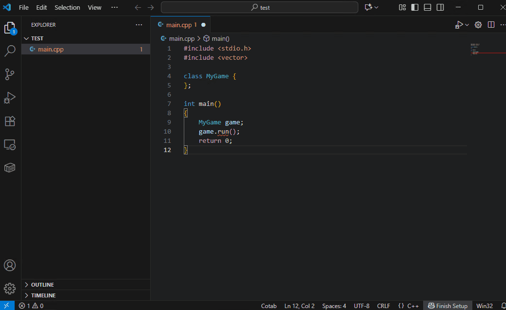

# Cotab

[English](README.md) | [日本語](README.ja.md) | [中文](README.zh-cn.md)

这是一个VS Code扩展，是一个AI驱动的多行自动补全插件，通过完全在本地LLM上运行，旨在实现最大程度的隐私和安全性。

它不仅基于整个文件的上下文，还基于外部符号、错误和先前的编辑，使用AI生成多行代码，并将它们作为自动补全建议呈现。
特别是Qwen3-Coder-30B-A3B提供与云服务相当的高质量补全，并针对VRAM 8GB环境进行了优化，可一键设置。

它还提供专用的仅翻译模式。

## 自动补全

支持的编程语言取决于AI模型。尽管体积紧凑，默认模型Qwen3-4B-Instruct-2507支持多种语言。

## 自动注释模式

一种添加代码注释的专用模式。AI理解光标位置的代码并自动添加详细注释。
Qwen3-4B-Instruct-2507已经能提供良好的注释，但此用例可以容忍性能下降，因此我们推荐使用Qwen3-Coder-30B-A3B以获得最佳结果。

## 自动翻译模式

仅翻译模式。它自动翻译不熟悉语言的注释，使代码更易于理解。
Qwen3-4B-Instruct-2507也能提供高质量的翻译，但在此用例中，建议使用Qwen3-Coder-30B-A3B以获得最佳结果，因为性能下降是可容忍的。

## 功能
- 优先考虑隐私，使用本地LLM完全离线运行
- 提供专注于内联建议的功能
- 不仅建议从光标位置的内联补全，还建议多行编辑
- 提供考虑目标文件的全部内容、来自其他文件的符号和编辑历史的建议
- 提供针对llama-server优化的快速响应
- 还提供自动注释和自动翻译模式
- 开源确保透明度

## 开始使用
1. 通过VS Code市场安装Cotab
   
  
2. 点击"Install Local Server"按钮或配置您的API。
   
   注意:
   - 首次可能需要一些时间，因为它会下载2.5GB的模型。
   - 安装支持的平台: Windows/MacOS/Ubuntu
  
3. 开始输入！
   
   
   |命令|快捷键|
   | ---- | ---- |
   |接受全部|Tab|
   |接受第一行|Shift + Tab|
   |拒绝|Esc|

   注意:
   - 通过拒绝，您可以更改下一个补全候选。
   - 斜体显示覆盖层表示AI仍在输出结果，结果尚未确定。在大多数情况下，它与最终结果相同，但在斜体显示的情况下，合并结果可能存在问题。

## 重要注意事项
- 请求通常涉及超过10,000个令牌的提示。
- 针对llama-server优化；我们强烈建议使用llama-server
- **使用按使用付费的API服务器时要特别小心，因为令牌消耗可能很快**
- 使用本地服务器时，**我们强烈建议单用户使用**

  本地服务器针对**单用户**进行了优化。
  多个用户同时使用将显著影响推理并严重降低响应速度

## 使用技巧

- 先写注释

  默认模型（Qwen3-4B-Instruct-2507）紧凑但功能强大，尽管它不是专门为代码补全设计的。与许多最近的云服务不同，它可能不会立即建议您想要编写的确切代码。在这种情况下，首先编写描述您想要的代码的注释将帮助模型根据您的描述生成更精确的代码建议。
  
  
- 编辑提示

  虽然模型质量很重要，但补全准确性在很大程度上取决于提示内容。通过自定义提示，您可能能够进一步提高准确性。

  此外，您可以创建自己的自定义模式。
  
  要编辑提示，请从菜单中打开它。默认提示已被注释掉。取消注释、编辑并保存，更改将立即反映在补全中。
  

## 性能
- **推荐:** 为了获得最佳性能，建议使用GeForce RTX 3000系列或更高版本的GPU（或同等产品）。

- Cotab针对llama-server和Qwen3-4B-Instruct-2507进行了优化，旨在高速运行。从第二个请求开始，即使对于超过1,000行的源文件，在GeForce RTX 4070上，即使提示超过15,000个令牌并包含数百个引用符号，它也能在大约0.5秒内理解整个上下文并显示补全。之后，它继续在每次击键时发送补全请求并保持。

- AI工作负载在GeForce RTX 3000系列及更高版本上看到显著的性能改进。建议使用GeForce RTX 3000系列或更高版本的GPU或同等产品以获得舒适的响应。

## 详细信息
- llama-server

  您也可以使用OpenAI兼容的API，但我们强烈建议使用llama-server。llama-server开销低，在使用llama.cpp作为后端的服务器中以最快速度运行。
  代码补全频繁重复请求和取消，因此开销直接影响用户体验。
  
- 提示优化

  llama-server默认启用一种机制，可以缓存来自先前请求的提示。提示缓存对与先前提示匹配的部分有效，允许跳过到该部分的提示处理。
  
  为了充分利用此机制，提示中的原始源代码在用户输入时保持不变。相反，修改后的周围代码的最小块被追加到提示的底部。

  提示完全可自定义，您可以一键在准备好的模式之间切换。
  这允许您为每个目的使用最佳提示执行补全。
  
- 编辑历史

  记住用户最近的编辑并在建议中利用它们。编辑分为添加、删除、编辑、重命名和复制，以提高预测准确性。
  
  这使得立即创建的函数更可能被建议，更准确地反映用户意图。
  
- 来自其他文件的符号

  使用可从VSCode的语言提供程序获得的符号，并在建议中利用它们。这些符号允许LLM理解类结构并提高成员函数建议的准确性。

  注意: 符号按在VS Code中查看文件的顺序输入。

- 错误问题

  使用诊断错误作为输入来生成修复错误的代码。
  即使使用小型AI模型，它也能学会纠正错误，因此建议的质量进一步提高。
  
- 代码摘要

  通过提前总结源代码并将结果纳入提示，我们实现了更深层次的理解。
  此功能默认禁用。因为即使没有摘要，补全质量也能得到保证，因为整个代码都被输入。

- 进度图标说明

  |图标|说明|
  | ---- | ---- |
  ||正在分析源代码|
  ||正在补全当前行|
  ||正在补全当前行之后|
  
## 隐私和遥测
- Cotab仅与默认端点`"http://localhost:8080/v1"`或用户指定的LLM API通信。不联系任何其他外部服务或服务器。这确保了最大程度的隐私和安全性。
  - 仅与配置的API进行通信
  - 从不发送遥测或使用数据
  - 用户代码或输入从不与第三方共享
  - 不收集或存储个人信息
  - 此项目是开源的，所有源代码都在GitHub上可用

- 通过此政策，您可以完全放心地使用Cotab。
- 注意: 如果您安装本地服务器，它会访问[llama.cpp github存储库](https://github.com/ggml-org/llama.cpp/releases)。

## 开发 / 贡献

- 欢迎贡献（问题、PR、改进建议）。
- 也欢迎错误修复、优化和分享基准测试结果。

## 如何构建

- 设置要求

  请提前安装VS Code。

- Windows

  运行此单个命令以自动下载并执行设置脚本。不需要任何东西，包括Git或Node.js - 所有便携版本都会自动下载并设置在./workspace中，项目将被克隆，VS Code将启动:
  
  ```bash
  mkdir cotab
  cd cotab
  powershell -NoProfile -Command "$f='run-vscode.bat'; (New-Object Net.WebClient).DownloadString('https://github.com/cotab-org/cotab/raw/refs/heads/main/run-vscode.bat') -replace \"`r?`n\",\"`r`n\" | Set-Content $f -Encoding ASCII; cmd /c $f"
  ```
  
  在vscode中按F5开始调试插件。
  
- Ubuntu

  需要Node.js(v22)。
    
  例如，通过包管理器安装Node.js v22。
  ```bash
  url -fsSL https://deb.nodesource.com/setup_22.x | sudo -E bash -
  sudo apt install -y nodejs
  ```
  
  Cotab克隆和配置。
  
  ```bash
  git clone https://github.com/cotab-org/cotab.git
  cd cotab
  npm install
  code .\
  ```
  
  在vscode中按F5开始调试插件。
  
- MacOS

  需要Node.js(v22)。
  
  例如，在macos上安装Node.js v22。
  ```bash
  # 安装nvm
  curl -o- https://raw.githubusercontent.com/nvm-sh/nvm/v0.40.3/install.sh | bash
  
  # 激活nvm
  \. "$HOME/.nvm/nvm.sh"
  
  # 安装node.js v22
  nvm install 22
  node -v
  ```
  
  Cotab克隆和配置。
  
  ```bash
  git clone https://github.com/cotab-org/cotab.git
  cd cotab
  npm install
  code .\
  ```
  
  在vscode中按F5开始调试插件。

- 创建包

```bash
npx vsce package
```

## FAQ

### 为什么开始使用Cotab时窗口会短暂闪烁？
短暂的窗口闪烁是因为Cotab在初始化期间计算字体大小。VS Code不提供直接API来获取字符大小，因此Cotab使用Webview来计算字体大小。这导致开始使用Cotab时出现短暂闪烁。

## 许可证
Copyright (c) 2025 cotab
Apache License 2.0
